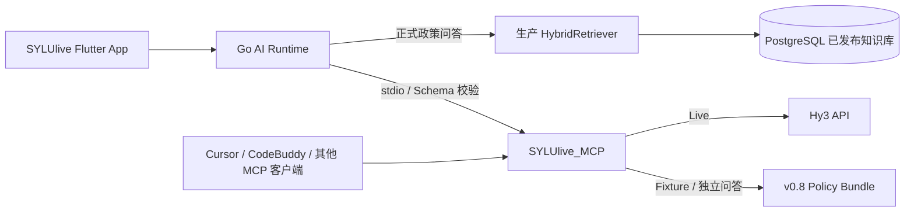

<div align="center">
  
  
  
  
  
</div>

# Hy3 Campus Decision Copilot（SYLUlive_MCP）

SYLUlive_MCP 是 [SYLUlive](https://github.com/zhouwu97/SYLUlive) 的独立校园决策 MCP Server，也可以被 Cursor、CodeBuddy 和其他兼容 MCP 的客户端单独使用。

项目以本地 `stdio` 方式运行，通过 Hy3 提供校园政策解释、竞赛比较、学业分析和周计划能力。它不直接连接 SYLUlive 的 PostgreSQL、生产 API、教务系统或用户账号，也不会持有教务密码、Cookie、JWT 等身份凭据。

第一版仅提供只读的分析、比较、解释与规划能力。正式政策和个人结果仍应以学校当年通知、学院审核、教务系统及学生本人授权数据为准。

## 🔗 与 SYLUlive 的联动

两个仓库采用“生产数据留在主服务、独立决策能力放入 MCP”的分工。



### 联动职责

| 场景 | SYLUlive | SYLUlive_MCP |
| --- | --- | --- |
| App 正式校园政策问答 | 使用生产 Go HybridRetriever、数据库发布状态和来源卡 | 不替代生产数据库检索 |
| 口语政策意图 | 加载共享 `policy_query_contract_v0.8.json` | 使用同一契约检索固定 SHA Bundle |
| 竞赛比较 | 提供真实赛事及用户授权画像 | 执行学校认定、人工评价、学生适配、证据质量四维比较 |
| 学业分析 | 生成最小化、非身份化学业快照 | 本地计算学分、挂科和数据完整度，再生成受约束解释 |
| 周计划 | 提供固定课程、目标及约束 | 在睡眠、固定事件、最小时间块和每日上限内排程 |
| 独立 MCP 客户端 | 不参与 | 可直接使用五个工具和公开演示资料 |

### 主服务实际调用的工具

SYLUlive Go 客户端当前通过 `stdio` 调用以下三个决策工具：

- `compare_competitions`
- `analyze_academic_snapshot`
- `plan_student_week`

`answer_campus_question` 主要用于独立 MCP 客户端、Fixture 演示和便携政策问答。App 的正式政策问答继续走生产 Go RAG，避免 Hy3 或 MCP 短暂不可用时校园政策功能整体中断。

### 双仓一致性

- MCP 契约版本为 `sylulive-hy3/1`。
- 每个工具同时公开输入 Schema、输出 Schema 和规范化 SHA-256。
- Go 客户端要求 `tools/list` 实际 Schema、状态工具声明摘要和本地固定摘要三者一致。
- 两个仓库保存字节一致的 `policy_query_contract_v0.8.json`。
- v0.8 Bundle 使用 `newline-lf-v1` 规范化摘要，Windows CRLF 与 Linux LF 检出结果一致。
- 当前规范化 Bundle SHA-256：

```text
2b93e4b02819497f821bddb73c5a5cb6e5fe711379e1986c19cccaa0cb4f7b2d
```

## 能力范围

| 工具 | 作用 | 本地确定性约束 |
| --- | --- | --- |
| `hy3_campus_status` | 查看脱敏运行状态、工具契约和政策包状态 | 不返回密钥、绝对路径或完整环境变量 |
| `answer_campus_question` | 基于本地政策 Bundle 和 Markdown 回答校园问题 | 仅引用检索到的来源；证据不足时拒绝作答 |
| `compare_competitions` | 比较 2 至 5 项赛事 | 四个维度分离，不伪造学校认定，不生成无依据总分 |
| `analyze_academic_snapshot` | 分析非身份化学业快照 | 学分、挂科、二课缺口和完整度由本地程序计算 |
| `plan_student_week` | 安排一周目标 | 不占用固定事件或睡眠，遵守最小时间块和每日上限 |

`HY3_MODE=disabled` 时只注册状态工具；`fixture` 和 `live` 模式注册全部五个工具。

## 政策检索 v0.8

政策问答加载 `examples/policy_bundle` 中经过摘要校验的 v0.8 Bundle，并按 Markdown 章节切分。

支持的典型问题包括：

```text
挂科怎么办
重修
重修费交不起怎么办
交不起学费
没钱吃饭
勤工俭学
奖学金怎么评
挂科了怎么办，奖学金还能评吗
```

检索规则包括：

- 中文二元、三元短语，不使用单汉字重叠评分。
- `category` 严格过滤。
- 标题、章节、制度短语和文档类型分层排序。
- 宽泛“挂科怎么办”同时覆盖补考与重修。
- 明确“重修”只检索重修制度，不混入历史补考细则。
- 资助、助学贷款、勤工助学和奖学金使用独立文档类型。
- Bundle 或共享意图契约摘要不一致时返回 `policy_bundle_integrity_failed`，不会伪装成“没有资料”。

勤工助学材料中“恰好两门不及格”的原始转录仍存在冲突。系统会披露冲突，并提示以学生处正式原文和当期审核结果为准，不会自动裁决。

## 环境要求与安装

- Python 3.11 或更高版本，推荐 Python 3.12。
- [uv](https://docs.astral.sh/uv/) 用于依赖和虚拟环境管理。

```powershell
cd C:/path/to/SYLUlive_MCP
uv sync
Copy-Item .env.example .env
```

不要把真实 API Key 提交到 `.env`、客户端配置或验证记录中。

## 运行模式

| 模式 | 配置 | 行为 | 适用场景 |
| --- | --- | --- | --- |
| Disabled | `HY3_MODE=disabled` | 只暴露 `hy3_campus_status` | 默认安全状态、配置检查 |
| Fixture | `HY3_MODE=fixture` | 使用固定响应并执行完整 Schema 校验 | 本地演示、CI、离线开发 |
| Live | `HY3_MODE=live` | 调用显式配置的 Hy3 OpenAI-compatible API | 生产联调和人工验证 |

启动 Fixture Server：

```powershell
cd C:/path/to/SYLUlive_MCP
$env:HY3_MODE = "fixture"
$env:HY3_CAMPUS_ROOT = "./examples"
$env:HY3_FIXTURE_ROOT = "./tests/fixtures/hy3"
uv run hy3-campus-decision-mcp
```

stdout 专用于 MCP JSON-RPC，诊断日志只写入 stderr。

## SYLUlive 主服务接入

主项目通过本地 `stdio` 启动独立 MCP。部署时应固定：

- MCP 可执行命令与工作目录；
- `HY3_MODE`、校园资料根目录和 Fixture 根目录；
- `sylulive-hy3/1` 契约版本；
- 三个主服务工具的固定 Schema 摘要；
- 进程超时、结果大小和最大并发；
- 外部模型授权和用户数据权限。

主项目的完整配置和部署流程见：

- [SYLUlive MCP 部署文档](https://github.com/zhouwu97/SYLUlive/blob/MCP/docs/ai/internal-hy3-mcp-deployment.md)
- [SYLUlive 主仓库](https://github.com/zhouwu97/SYLUlive)

独立 MCP 不应自行读取生产数据库。主服务负责权限、真实业务数据和结果落库，MCP 只接收单次工具调用所需的最小结构化数据。

## 其他 MCP 客户端接入

仓库提供可作为起点的配置：

- [Cursor 配置](clients/cursor.mcp.json)
- [CodeBuddy 配置](clients/codebuddy.mcp.json)

示例：

```json
{
  "command": "uv",
  "args": [
    "--directory",
    "/ABSOLUTE/PATH/TO/SYLUlive_MCP",
    "run",
    "hy3-campus-decision-mcp"
  ],
  "env": {
    "HY3_MODE": "fixture",
    "HY3_CAMPUS_ROOT": "./examples",
    "HY3_FIXTURE_ROOT": "./tests/fixtures/hy3"
  }
}
```

将绝对目录替换为本机路径即可。

## 工具结果契约

所有输入拒绝未知字段。成功结果使用统一信封：

```json
{
  "status": "ok",
  "result": {},
  "deterministic_findings": {},
  "sources": [],
  "warnings": [],
  "model": {
    "provider": "hy3",
    "model": "hy3",
    "mode": "fixture",
    "reasoning_effort": "low"
  },
  "meta": {
    "schema_version": "1",
    "generated_at": "2026-07-27T00:00:00Z"
  }
}
```

失败时返回稳定错误：

```json
{
  "status": "error",
  "code": "policy_bundle_integrity_failed",
  "message": "The local policy bundle failed its integrity check."
}
```

Hy3 错误会区分认证失败、限流、服务端错误、超时、连接失败、非法 JSON、Schema 不符和来源越界。只有限流、服务端错误及连接失败允许短退避后最多重试一次；认证、超时和来源越界立即安全失败。

## 数据、路径与网络安全

- 路径输入只能位于 `HY3_CAMPUS_ROOT` 内，拒绝绝对路径、`..` 穿越和符号链接越界。
- 仅读取允许的文本和结构化文件类型，并限制文件数量与大小。
- HTTPS 始终允许；HTTP 仅允许本机或显式启用的私网地址。
- 公网 HTTP、URL userinfo、query、fragment 和重定向均被拒绝。
- 日志和工具结果不包含 API Key、Authorization、完整模型原始响应、用户身份字段或绝对路径。
- 项目不会连接 SYLUlive 生产 API、数据库、账号体系或教务系统，也不执行远程写操作。
- 恢复 Hy3 已知单键 JSON 包装异常后，结果仍必须通过严格 Pydantic Schema 和来源白名单。

完整配置项见 [`.env.example`](.env.example)。

## 本地验证与 CI

无需 Hy3 Key 的验证：

```powershell
uv run ruff format --check .
uv run ruff check .
uv run pytest -q
uv run python scripts/selfcheck.py
uv run python scripts/sdk_stdio_client.py
uv run python scripts/validate_examples.py
```

`sdk_stdio_client.py` 会启动真实子进程，验证 `initialize`、`tools/list` 和四个核心工具的 `tools/call`。

生产或联调环境还应执行 Go → Python 的真实 `stdio` 契约测试，确认工具列表、状态摘要、输入/输出 Schema 和固定摘要一致。

## Live 验证

真实 Hy3 验证不会进入公共 CI，也不能由 Fixture 结果替代。

```powershell
$env:HY3_MODE = "live"
$env:HY3_API_BASE = "https://your-hy3-host/v1"
$env:HY3_API_KEY = "<仅在当前终端设置>"
$env:HY3_MODEL = "hy3"
uv run python scripts/verify_live_hy3.py
```

脱敏的真实调用、协议、错误分类和参数兼容性记录见 [Live 验证记录](assets/live-verification.md)。记录不会包含 API Key、完整 Host、绝对路径或模型原始响应。

## 目录说明

```text
src/hy3_campus_decision_mcp/  MCP Server、Hy3 客户端、安全策略和确定性算法
examples/policy_bundle/       固定 SHA 的 v0.8 政策 Bundle 和共享意图契约
examples/campus_documents/    公开演示文档
tests/fixtures/               Fixture Provider 固定响应
clients/                      Cursor 与 CodeBuddy 配置
scripts/                      自检、stdio、示例和 Live 验证脚本
assets/contracts/             版本化输入/输出 Schema 清单
assets/live-verification.md   脱敏真实验证记录
```

## 许可证

[MIT](LICENSE)
