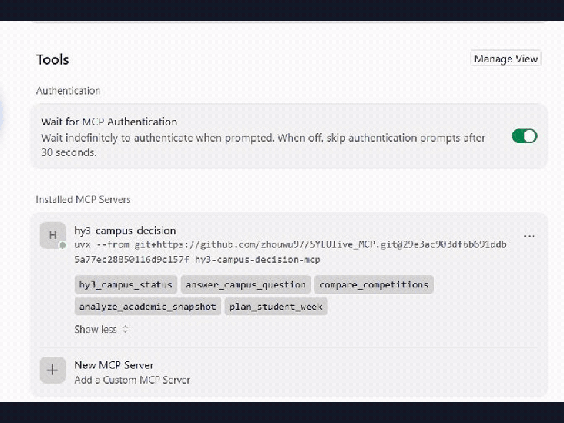
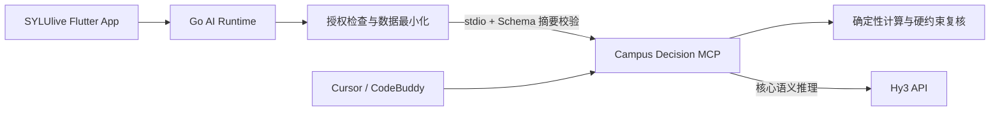

<div align="center">
  
  
  
  
  
</div>

# Hy3 Campus Decision Copilot（SYLUlive_MCP）

**Hy3 Campus Decision Copilot 是一个隐私保护、证据约束、可确定性复核的校园决策 MCP Server，帮助学生解释政策、分析学业、比较竞赛并生成无课程冲突的周计划。**

它不是校园聊天机器人。系统只接收最小化、非身份化数据，把确定性计算与 Hy3 推理解耦，并在模型输出后再次检查来源、Schema 和计划硬约束。它既能被 Cursor、CodeBuddy 等客户端独立调用，也已进入真实 [SYLUlive](https://github.com/zhouwu97/SYLUlive) Flutter + Go 产品链路。



上图是 60 秒 Fixture 模式客户端演示，展示五个工具发现、学业分析成功结果和路径越界安全拒绝；Fixture 只证明协议与确定性逻辑，真实 Hy3 调用证据单独记录。

## 30 秒安装与自检

安装并查看版本，不需要克隆仓库或填写绝对路径：

```powershell
uvx --from "git+https://github.com/zhouwu97/SYLUlive_MCP.git@8bc6d4f753eda4a18e0bc1bb631f107bd0b4d01d" hy3-campus-decision-mcp --version
```

启动真实 MCP 子进程，完成 `initialize`、`tools/list` 和四个核心工具调用：

```powershell
uvx --from "git+https://github.com/zhouwu97/SYLUlive_MCP.git@8bc6d4f753eda4a18e0bc1bb631f107bd0b4d01d" hy3-campus-decision-mcp --selfcheck
```

自检使用随 wheel 分发的公开 Fixture，不需要 API Key。正式 Live 模式通过环境变量提供 Hy3 OpenAI-compatible 端点和密钥，代码及客户端配置中不保存凭据。

## Campus Decision Loop

五个工具不是互不相关的功能集合，而是一条从判断现状到执行复核的学生决策链：

```text
政策解释与来源核验
        ↓
学业状态确定性计算
        ↓
竞赛机会四维比较
        ↓
可执行周计划生成
        ↓
课程、睡眠、时长硬约束复核
```

典型问题是：“我大二、有一门挂科，本周只有 12 小时，这两个比赛哪个更适合我，接下来一周怎么安排？”系统不会让模型自行计算学分或自由编造计划：挂科与缺口由本地程序计算，赛事认定与个人适配保持分离，最终时间块必须通过硬约束校验。

## 可复现量化结果

仓库公开 30 个确定性护栏案例和 5 个完整 MCP 协议案例。CI 会重新运行并检查两份结果文件是否与实现一致。

| 客观指标 | 结果 |
| --- | ---: |
| 学业确定性案例 | 10 / 10 通过 |
| 周计划硬约束违规 | 0 |
| 竞赛四维分离案例 | 5 / 5 通过 |
| 路径与敏感字段安全拒绝 | 5 / 5 通过 |
| 确定性护栏总计 | 30 / 30 通过 |
| 完整 MCP 协议案例 | 5 / 5 通过 |

- [评测方法与复现命令](evaluation/README.md)
- [完整案例](evaluation/cases.json)
- [机器可读结果](evaluation/results.json)
- [MCP 协议机器可读结果](evaluation/mcp-results.json)
- [脱敏真实 Hy3 验证记录](assets/live-verification.md)

这些结果只衡量可客观判定的计算、约束和安全属性，不把 Fixture 输出冒充真实 Hy3 效果，也不发布缺少同批提示与人工标注的“直接模型对照”。

## 五个 MCP 工具

| 工具 | 作用 | 本地确定性约束 |
| --- | --- | --- |
| `hy3_campus_status` | 查看脱敏运行状态、工具契约和政策包状态 | 不返回密钥、绝对路径或完整环境变量 |
| `answer_campus_question` | 基于本地政策 Bundle 和 Markdown 回答校园问题 | 仅引用检索到的来源；证据不足时拒答 |
| `compare_competitions` | 比较 2 至 5 项赛事 | 学校认定、人工评价、学生适配、证据质量四维分离 |
| `analyze_academic_snapshot` | 分析非身份化学业快照 | 学分、挂科、二课缺口和完整度由本地程序计算 |
| `plan_student_week` | 安排一周目标 | 不占用固定事件或睡眠，遵守最小时间块和每日上限 |

`HY3_MODE=disabled` 时只注册状态工具；`fixture` 和 `live` 模式注册全部五个工具。

## Cursor 与 CodeBuddy

项目级配置已经使用 `uvx`，不要求用户修改仓库绝对路径：

- [Cursor 工作区配置](.cursor/mcp.json)
- [CodeBuddy / VS Code 工作区配置](.vscode/mcp.json)
- [可复制客户端配置](clients/)
- [Cursor 与 CodeBuddy 原生调用证据](assets/client-verification.md)

```json
{
  "mcpServers": {
    "hy3-campus-decision": {
      "command": "uvx",
      "args": [
        "--from",
        "git+https://github.com/zhouwu97/SYLUlive_MCP.git@8bc6d4f753eda4a18e0bc1bb631f107bd0b4d01d",
        "hy3-campus-decision-mcp"
      ],
      "env": {"HY3_MODE": "fixture"}
    }
  }
}
```

Fixture 演示可直接调用：

```text
请先列出 hy3-campus-decision 的工具，然后调用 analyze_academic_snapshot，
snapshot_path 使用 academic/safe_snapshot.json。
```

Live 模式将 `HY3_MODE` 改为 `live`，并在客户端的安全环境配置中提供 `HY3_API_BASE`、`HY3_API_KEY` 和 `HY3_MODEL`。不要把真实 Key 写入项目配置并提交。

## Hy3 在系统中的作用

本地代码负责可复核事实，Hy3 负责需要语义理解与权衡表达的核心推理：

| 本地确定性层 | Hy3 推理层 |
| --- | --- |
| 计算学分、挂科和数据完整度 | 解释风险与行动优先级 |
| 检索并白名单化政策来源 | 在证据范围内归纳政策含义 |
| 分离赛事的四个比较维度 | 结合学生约束解释选择权衡 |
| 生成并复核合法时间块 | 组织执行策略与调整建议 |

Fixture 只用于离线演示和 CI。真实端点验证已关闭 Fixture，并验证四个核心工具、严格输出 Schema、来源 ID 白名单及 Go → Python stdio 契约；详见 [Live 验证记录](assets/live-verification.md)。

## 真实产品架构

生产身份、权限和业务数据留在 SYLUlive 主服务；独立 MCP 只接收单次决策所需的最小数据。



主项目比赛分支为 `SYLUlive/rhinobird/hy3-mcp-integration`，MCP 比赛分支为 `SYLUlive_MCP/rhinobird/hy3-campus-copilot`。Go 客户端实际通过 stdio 调用 `compare_competitions`、`analyze_academic_snapshot` 和 `plan_student_week`；App 正式政策问答保留生产 Go RAG，避免外部模型不可用时政策服务整体中断。

跨仓库完整性由 `sylulive-hy3/1` 契约、输入/输出 Schema、规范化 SHA-256、`tools/list`、状态声明和 Go 本地固定摘要共同校验。v0.8 Bundle 使用 `newline-lf-v1`，Windows CRLF 与 Linux LF 得到相同摘要：

```text
2b93e4b02819497f821bddb73c5a5cb6e5fe711379e1986c19cccaa0cb4f7b2d
```

- [SYLUlive MCP 部署文档](https://github.com/zhouwu97/SYLUlive/blob/rhinobird/hy3-mcp-integration/docs/ai/internal-hy3-mcp-deployment.md)
- [SYLUlive 主仓库](https://github.com/zhouwu97/SYLUlive)

## 安全与故障证据

| 攻击或故障 | 稳定结果 |
| --- | --- |
| `../../secret.env` | `path_traversal_rejected` |
| 绝对路径或符号链接越界 | 拒绝工作区外来源 |
| 伪造来源 ID | `hy3_source_reference_invalid` |
| 模型额外字段或非法 Schema | `hy3_schema_invalid` |
| Bundle 或意图契约被修改 | `policy_bundle_integrity_failed` |
| Hy3 超时 | `hy3_timeout`，不继续重试 |
| API Key 出现在异常链 | 日志和响应脱敏 |
| 课程、睡眠或每日上限冲突 | `plan_validation_failed` |
| 学业输入包含姓名、学号、Cookie 或 Token | `sensitive_field_rejected` |
| 用户未授权外部模型 | Go 侧不注册或调用 Hy3 工具 |

路径、网络、来源、输入输出、日志和 Bundle 均采用安全失败策略。MCP 不连接 SYLUlive 生产数据库、教务系统或账号体系，也不持有教务密码、Cookie、JWT。

## 政策 Bundle v0.8

政策问答加载经过摘要校验的 v0.8 Bundle，按 Markdown 章节切分并使用中文二元、三元短语检索。支持补考、重修、资助、勤工助学、奖学金和创新学分等演示问题；资料冲突时披露冲突，不自动裁决。正式政策和个人结果仍应以学校当年通知、学院审核和教务系统为准。

## 运行模式

| 模式 | 配置 | 行为 | 适用场景 |
| --- | --- | --- | --- |
| Disabled | `HY3_MODE=disabled` | 只暴露 `hy3_campus_status` | 默认安全状态、配置检查 |
| Fixture | `HY3_MODE=fixture` | 使用固定响应并执行完整 Schema 校验 | 本地演示、CI、离线开发 |
| Live | `HY3_MODE=live` | 调用显式配置的 Hy3 OpenAI-compatible API | 生产联调和人工验证 |

源码开发环境：

```powershell
git clone --branch rhinobird/hy3-campus-copilot https://github.com/zhouwu97/SYLUlive_MCP.git
cd SYLUlive_MCP
uv sync --frozen
uv run hy3-campus-decision-mcp --selfcheck
```

stdout 专用于 MCP JSON-RPC，诊断日志只写入 stderr。

## 双仓职责边界

| 场景 | SYLUlive | SYLUlive_MCP |
| --- | --- | --- |
| App 正式校园政策问答 | 使用生产 Go HybridRetriever、数据库发布状态和来源卡 | 不替代生产数据库检索 |
| 口语政策意图 | 加载共享 `policy_query_contract_v0.8.json` | 使用同一契约检索固定 SHA Bundle |
| 竞赛比较 | 提供真实赛事及用户授权画像 | 执行学校认定、人工评价、学生适配、证据质量四维比较 |
| 学业分析 | 生成最小化、非身份化学业快照 | 本地计算学分、挂科和数据完整度，再生成受约束解释 |
| 周计划 | 提供固定课程、目标及约束 | 在睡眠、固定事件、最小时间块和每日上限内排程 |
| 独立 MCP 客户端 | 不参与 | 可直接使用五个工具和公开演示资料 |

## 工具结果契约

所有输入拒绝未知字段。成功结果使用统一信封：

```json
{
  "status": "ok",
  "result": {},
  "deterministic_findings": {},
  "sources": [],
  "warnings": [],
  "model": {
    "provider": "hy3",
    "model": "hy3",
    "mode": "fixture",
    "reasoning_effort": "low"
  },
  "meta": {
    "schema_version": "1",
    "generated_at": "2026-07-27T00:00:00Z"
  }
}
```

失败时返回稳定错误：

```json
{
  "status": "error",
  "code": "policy_bundle_integrity_failed",
  "message": "The local policy bundle failed its integrity check."
}
```

Hy3 错误会区分认证失败、限流、服务端错误、超时、连接失败、非法 JSON、Schema 不符和来源越界。只有限流、服务端错误及连接失败允许短退避后最多重试一次；认证、超时和来源越界立即安全失败。

## 数据、路径与网络安全

- 路径输入只能位于 `HY3_CAMPUS_ROOT` 内，拒绝绝对路径、`..` 穿越和符号链接越界。
- 仅读取允许的文本和结构化文件类型，并限制文件数量与大小。
- HTTPS 始终允许；HTTP 仅允许本机或显式启用的私网地址。
- 公网 HTTP、URL userinfo、query、fragment 和重定向均被拒绝。
- 日志和工具结果不包含 API Key、Authorization、完整模型原始响应、用户身份字段或绝对路径。
- 项目不会连接 SYLUlive 生产 API、数据库、账号体系或教务系统，也不执行远程写操作。
- 恢复 Hy3 已知单键 JSON 包装异常后，结果仍必须通过严格 Pydantic Schema 和来源白名单。

完整配置项见 [`.env.example`](.env.example)。

## 本地验证与 CI

无需 Hy3 Key 的验证：

```powershell
uv run ruff format --check .
uv run ruff check .
uv run pytest -q
uv run python evaluation/run_evaluation.py --check
uv run hy3-campus-decision-mcp --version
uv run hy3-campus-decision-mcp --selfcheck
uv run python scripts/sdk_stdio_client.py --check
uv run python scripts/validate_examples.py
uv build
uv run python scripts/verify_distribution.py
```

CI 在 Ubuntu 与 Windows、Python 3.11 与 3.12 的四组矩阵中执行上述检查。`verify_distribution.py` 会把 wheel 安装到全新临时虚拟环境，再从源码目录之外验证版本、自包含资源和完整 stdio 自检。

生产或联调环境还应执行 Go → Python 的真实 `stdio` 契约测试，确认工具列表、状态摘要、输入/输出 Schema 和固定摘要一致。

## Live 验证

真实 Hy3 验证不会进入公共 CI，也不能由 Fixture 结果替代。

```powershell
$env:HY3_MODE = "live"
$env:HY3_API_BASE = "https://your-hy3-host/v1"
$env:HY3_API_KEY = "<仅在当前终端设置>"
$env:HY3_MODEL = "hy3"
uv run python scripts/verify_live_hy3.py
```

脱敏的真实调用、协议、错误分类和参数兼容性记录见 [Live 验证记录](assets/live-verification.md)。记录不会包含 API Key、完整 Host、绝对路径或模型原始响应。

## 目录说明

```text
src/hy3_campus_decision_mcp/  MCP Server、Hy3 客户端、安全策略和确定性算法
examples/policy_bundle/       固定 SHA 的 v0.8 政策 Bundle 和共享意图契约
examples/campus_documents/    公开演示文档
tests/fixtures/               Fixture Provider 固定响应
clients/                      Cursor 与 CodeBuddy 配置
evaluation/                   30 个护栏案例、5 个 MCP 协议案例及机器可读结果
scripts/                      构建隔离验证、stdio、示例和 Live 验证脚本
assets/contracts/             版本化输入/输出 Schema 清单
assets/live-verification.md   脱敏真实验证记录
```

## 许可证

[MIT](LICENSE)
