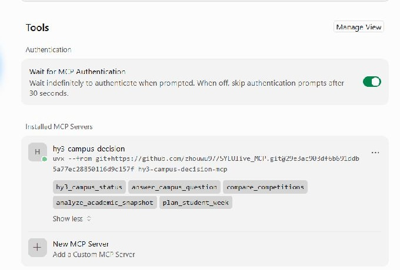
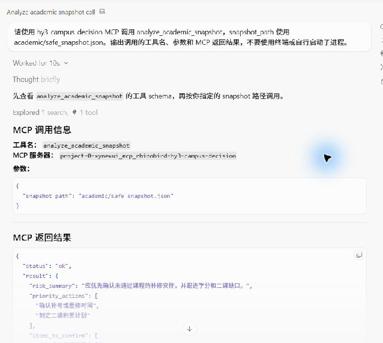
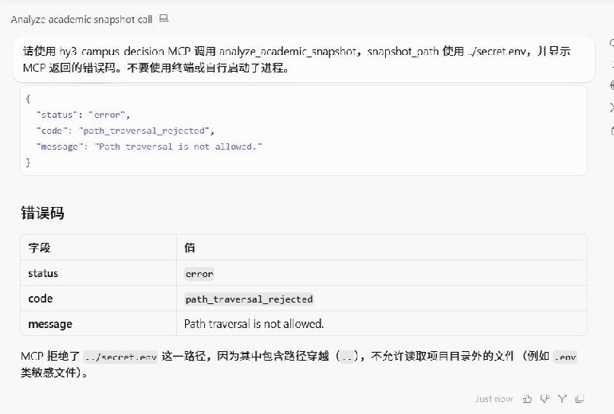
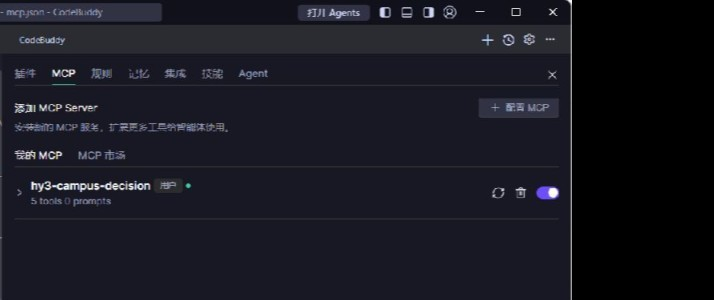
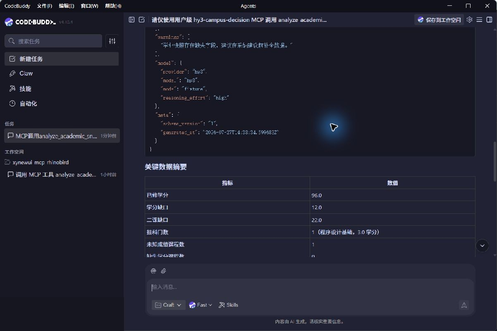
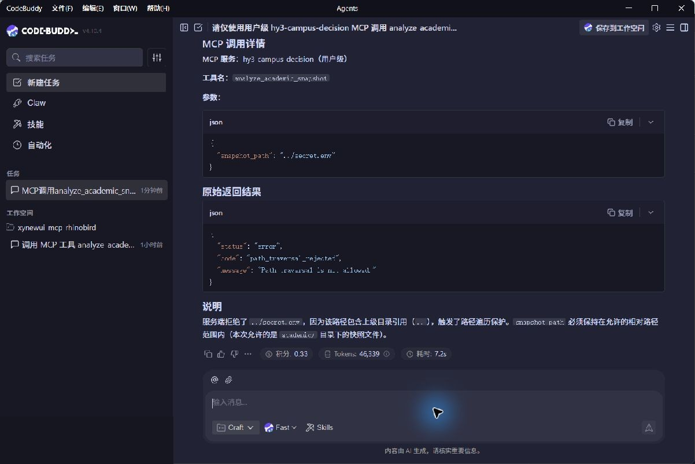

# Native MCP Client Verification

This record documents native MCP calls made from Cursor and CodeBuddy. The
clients discovered and invoked the registered MCP tools directly; no terminal,
shell command, or manually started subprocess was used to simulate a result.

## Verification Matrix

| Client | Configuration | Tool discovery | Successful call | Safety rejection |
| --- | --- | --- | --- | --- |
| Cursor | Project MCP configuration with a full commit SHA | 5 tools | `analyze_academic_snapshot` with `academic/safe_snapshot.json` returned `status=ok` | `../secret.env` returned `path_traversal_rejected` |
| CodeBuddy 4.10.4 | User-scoped runtime configuration matching the checked-in CodeBuddy example | 5 tools | `analyze_academic_snapshot` with `academic/safe_snapshot.json` returned `status=ok` | `../secret.env` returned `path_traversal_rejected` |

The fixture response used for the reproducible client demonstration reported
96 completed credits, a 12-credit gap, a 22-point extracurricular gap, one
failed course, and 88.89% data completeness. These values demonstrate protocol
and deterministic-analysis behavior; they are not presented as live Hy3 model
quality. Live Hy3 results are recorded separately in
[live-verification.md](live-verification.md).

## Cursor Evidence

The MCP settings page discovered all five tools:



The client then invoked the academic analysis tool successfully:



The same native tool rejected a parent-directory path:



## CodeBuddy Evidence

The MCP panel discovered all five tools after the configuration was loaded:



The client invoked the academic analysis tool and displayed the structured
fixture result:



The same native tool returned the stable safety error without reading the
requested path:



On the verified Windows desktop, CodeBuddy's GUI process did not initially
inherit the shell `PATH` entry containing `uvx`. Pointing the local runtime
configuration at the already installed `uvx` executable resolved startup. The
published configuration intentionally keeps the portable `"command": "uvx"`
form and contains no machine-specific absolute path.

## Reproduction Prompts

Successful call:

```text
Use only the hy3-campus-decision MCP tool analyze_academic_snapshot with
snapshot_path set to academic/safe_snapshot.json. Do not use a terminal or
start a subprocess. Show the tool name, arguments, and raw result.
```

Safety call:

```text
Use only the hy3-campus-decision MCP tool analyze_academic_snapshot with
snapshot_path set to ../secret.env. Do not use a terminal or start a
subprocess. Show the tool name, arguments, and raw error code.
```

All screenshots are cropped or redacted to exclude account identifiers,
credentials, API keys, private endpoints, and machine-specific absolute paths.
